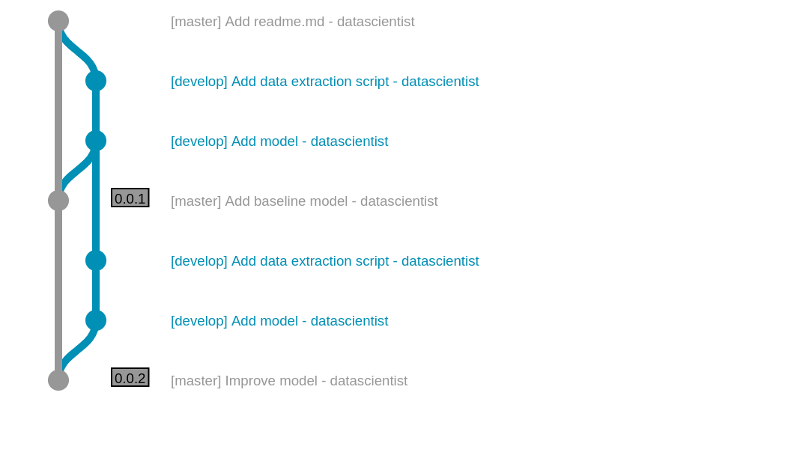
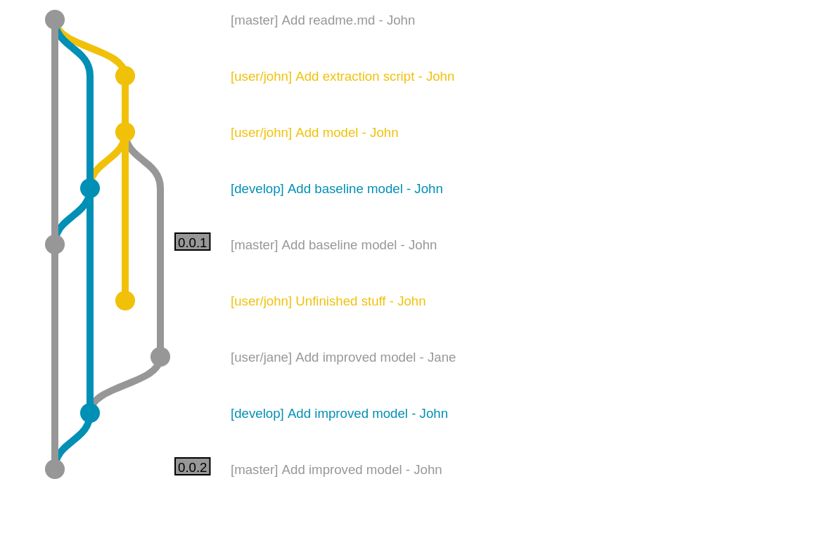

# Booting your ML project

> Context :
>
> You are a junior data scientist, recently hired in a team.
>
> Your manager gives you a project to boot, but you don't know where to start.

## Project organization

### Basic assumptions

At the moment, there is no common consensus on data science project organization. Data scientists don't have the same background. Some may come from research, like physics, whereas others comes from computer science. Either way, data scientists rarely have common project management practices. Furthermore, data science teams varies greatly from company to company. Sometime, they are embedded within a development/product team. Some other companies have dedicated data science teams within the IT division, or the business department they work for.

This variety brings a refreshing wealth into an organization. However, it also means that one of the most pressing questions is **which responsibility does a data scientist have** ? For example, a data science that mainly focus on quantitative analysis of the data wouldn't need to know anything about putting models in production. A data science team that work closely with dev teams would adapt itself to meet code quality and interoperability criterions.

There are several basics that should still be assumed. Let's highlight them:

- Data Science is (mainly) code,
  - so git management is a necessary evil.
  - code is organized within folders
  - development environment is shared within a team
  - code quality is a must
- DSc analysis is reproducible
  - analysis workflows (or pipelines) are not written in a readme, but coded (shell or python will do)
  - data management is thought from the get-go.
  - when a project is closed, the final datasets are archived

### Basic folder organization with only scripts

Python packages already have a quite standardized approach to code management. However, data science is usually constituted by scripts more than classes and functions. That's why this approach wouldn't work in most use cases. The proposed project organization is based on the excellent work of the [cookiecutter data science](https://drivendata1.github.io/cookiecutter-data-science/). It was modified to be similar to [java's maven directory layout](https://maven.apache.org/guides/introduction/introduction-to-the-standard-directory-layout.html), or a common [C/C++ directory layout](https://hiltmon.com/blog/2013/07/03/a-simple-c-plus-plus-project-structure/). Let's break out the different folders:

- *src* holds all the scripts necessary to run the project.
- *data* holds all the **local** data. It is not kept in the git: it is a temporary folder built at runtime.
  - *data/raw* are extracted with *src/data* scripts. It could come from data repository like S3 or a datalake.
  - *data/processed* contains datasets ready to be fed to algorithms. It is the output of *src/features* code. It might be pushed back to a data repository as a data product.
- *target* holds the results of running the scripts.
  - *target/models* comes from *src/models* where the ML magic do its stuff
  - *target/visualisation* comes from *src/visualisation*
- *requirements.txt* and *pipeline.py* are the core element to ensure respectively reproducible environment and execution. A *Dockerfile* might be added with some complex cases.

```sh
.
├── docs
├── README.md
│
├── data
│   ├── external
│   ├── interim
│   ├── processed
│   └── raw # never edited; stored in s3
│
├── src
│   ├── __init__.py    # Makes src a Python module
│   ├── data
│   ├── features
│   ├── models
│   └── visualization
|
├── target
|   ├── logs
│   ├── models
│   └── graphs
|
| # to reproduce the analysis.
├── requirements.txt
└── pipeline.py # a pipeline, eg luigi/airflow dag

```

To run the project, a couple of commands could be:

```shell
$ cd /path/to/my/project
# create an env with conda
$ conda create -n my_env python=x.x anaconda
$ activate my_env
$ conda install --yes pip
$ pip install --file requirements.txt
# we need this line if a script import something from
# another piece of code in src
$ export PYTHONPATH="$PYTHONPATH:/path/to/my/project"
$ python pipeline.py
```

### Adding functions and classes

The previous approach has a basic default: it doesn't use [common python packaging procedure](https://python-packaging.readthedocs.io/en/latest/minimal.html).  This alternative allows for multiple modules and packages to be installed. Whatever some says, a good data scientist would need some classes and/or functions within the project. Joel Grus, Mark Neumann and Matt Gardner at AllenNLP came up with a [great presentation](https://docs.google.com/presentation/d/17NoJY2SnC2UMbVegaRCWA7Oca7UCZ3vHnMqBV4SUayc/edit?usp=sharing) that all should read. The tree inspiration of this proposition comes from [this project](https://github.com/equinor/data-science-template).

```python
.
├── docs
├── README.md
│
├── data
│   ├── external
│   ├── interim
│   ├── processed
│   └── raw # never edited; stored in s3
│
├── setup.py # allow to install my_package within an environment
├── src
│   ├── my_package
│   │   ├── __init__.py
│   │   └── ...
│   └── scripts_project1
│       ├── data
|       |   └── pipeline_data.py
│       ├── features
│       ├── models
│       └── visualization
|
├── target
|   ├── logs
│   ├── models
│   └── visualization
|
|   # to reproduce the analysis.
├── requirements.txt
└── pipeline.py # a luigi/airflow dag

```

To run scripts here, the bash script would be only one line different.

```shell
$ cd /path/to/my/project
# create an env with conda
$ conda create -n my_env python=x.x anaconda
$ activate my_env
$ conda install --yes pip
$ pip install --file requirements.txt
# install the custom package in the env
$ python setup.py
$ python pipeline.py
```

## Git workflow

### Data science and dev workflow are fundamentally different

Once your project folder organization is done, the next step is to find a proper project workflow. And the main tool for that is git. There is multiple possible git workflow in the dev world. [Github flow](https://guides.github.com/introduction/flow/) is the most simple workflow out there. Start with a master branch, develop in other branches, then merge it. *master* branch is pushed to production. The most obvious is  [Gitflow](https://nvie.com/posts/a-successful-git-branching-model/). It is quite complex and works well for ambitious projects. Additionally, you could find [Gitlab flow](https://docs.gitlab.com/ee/workflow/gitlab_flow.html), [OneFlow](https://www.endoflineblog.com/oneflow-a-git-branching-model-and-workflow#oneflow-advantages) or [trunk flow](https://hackernoon.com/trunk-based-development-vs-git-flow-b1b23044dfb).

In the dev world, a *feature* or a *story* is a small functionality that improves the current product. It is especially useful for large teams and long-running development. But data science is mainly short-lived code development with small teams. That's why feature-based development is not really efficient in this context.

Another difference between dev and data worlds is that production is quite different. For a data scientist, production means that the code works and gives the correct analysis, not that there is any software deployed. The "production" benchmark for a data scientist is thus that **the analysis fits the demand and is reproducible**.

This has some implication on how data scientist should use git workflow:

- use git right - obviously, write [good commit messages](https://chris.beams.io/posts/git-commit/), and learn rebasing
- master is the finished product - an analysis, a model ready to train and deploy... Don't you ever dare to push to master
- feature based worflow is not always the right solution.
- Let's find some right workflow for data science!

### Simple workflow for one data scientist

This worfklow is really simple. Master is protected and holds the product. The data scientist use the develop branch and merge it when an iteration is ready. Nothing complex here, but a minimalistic code versioning and management.



### Simple workflow for several data scientists

This workflow is only a small evolution from the previous simple. Instead of committing to the develop branch, data scientists do their stuff in their own branch, and sync together on *develop* branch.



### Scaling git workflow up

The drawback of these work is that they work well for small projects, but does not scale to a larger team working on a same product. There are several strategies to deal with that. If the data scientists are embedded within a product team, then adopt the gitflow or any other classic workflow. Data science as a whole can be treated this way as a feature.

If there complete teams of data scientists, then it might seem wise to split the work with several repositories. For example, think that each repository build one or several models that are pushed to a model storage. The "app" team is then free to choose which model to use from the model store.

## A few words about versioning

### The problem with data science versions

In software engineering, versioning allows to fix a specific release of the software. But in data science, models are the released products, and they are built with both code and data. This is why a model version would need to include both code versioning and data versioning.

### Code versioning

Code versioning is well thought. [Semantic Versioning](https://semver.org/) is the most common standard. It is summarized as follows:

> Given a version number MAJOR.MINOR.PATCH, increment the:
>
> 1. MAJOR version when you make incompatible API changes,
> 2. MINOR version when you add functionality in a backwards-compatible manner, and
> 3. PATCH version when you make backwards-compatible bug fixes.
>
> Additional labels for pre-release and build metadata are available as extensions to the MAJOR.MINOR.PATCH format.

[Calendar versionning](https://calver.org/) is a common alternative, used by Ubuntu or pip. Note that python has its own complex but flexible [versioning](https://www.python.org/dev/peps/pep-0440/), that accepts most versions. CalVer doesn't guarantee backward compatibility. It is designed as follows:

> - **Major** - The first number in the version. 2 and 3 are Python's famous major versions. The major segment is the most common calendar-based component.
> - **Minor** - The second number in the version. 7 is the most popular minor version of Python.
> - **Micro** - The third and usually final number in the version. Sometimes referred to as the "patch" segment.
> - **Modifier** - An optional text tag, such as "dev", "alpha", "beta", "rc1", and so on.

For example, pip current version is *19.xx*, which means that the release dates from 2019. Anaconda has  for example the *2019.03* release. SemVer ease dependency management, whereas CalVer is efficient for large, stable projects.

### The unknown: data versioning

There isn't any good practice within the field of data versioning. It always depends a lot on the context and responsibilities within the company. For example, a dataset versioning would use CalVer as it fits nicely the requirements. For example:

- Batch-based datasets, e.g. January would be 2019.01 version

- Snapshot of data, which are managed like python dependencies.

Another option is around the existence of a "data fabric", or "feature store". Versions are not affected to datasets, but instead to features. However, it usually requires a really mature data engineering team, which would document the use of these versions and it's API.

### The ugly: ML models versions

Models are sometime built once and for all. However, sometime the code may be the same, but the dataset may change - or the other  way around. That's why it might be necessary to tag a model with the data version and the code version used to built it. This allows a fine grained understanding of the model training.

## Todo list

1. choose a project folder organization (and stick to it)
2. don't hesitate to develop a package whatever small it might be
3. find a workflow that fit your use case
4. ask if you need to version your code
5. version your data. Always.

## Reading List

| type    | TL;DR                                | year   | link                                                         |
| ------- | ------------------------------------ | ------ | ------------------------------------------------------------ |
| git     | Learn git :)                         | 2018 ? | [link](https://www.git-tower.com/learn/git/ebook/en/command-line/appendix/best-practices) |
| Project | Azure template - see the Docs folder | 2018   | [link](https://github.com/Azure/Azure-TDSP-ProjectTemplate)  |


